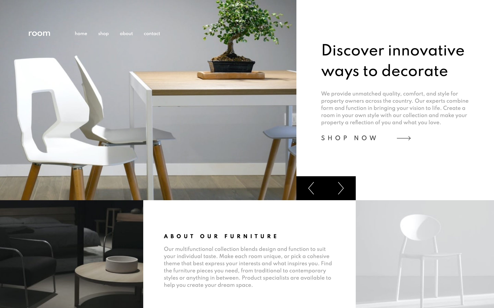

# Frontend Mentor - Room Homepage solution

A personal solution to [Room homepage challenge on Frontend Mentor](https://www.frontendmentor.io/challenges/room-homepage-BtdBY_ENq). Frontend Mentor challenges help you improve your coding skills by building realistic projects.

## Table of contents

- [Overview](#overview)
  - [The challenge](#the-challenge)
  - [Screenshot](#screenshot)
  - [Links](#links)
- [My process](#my-process)
  - [Built with](#built-with)
- [Author](#author)
- [Acknowledgments](#acknowledgments)

## Overview

This is a fictional furniture ecommerce homepage, a grid system showcase each section as card with a flat feel.

### The challenge

Users should be able to:

- View the optimal layout for the site depending on their device's screen size
- See hover states for all interactive elements on the page
- Navigate the slider using either their mouse/trackpad or keyboard

### Screenshot

### Links

- Solution URL: [FM Solution](https://www.frontendmentor.io/challenges/room-homepage-BtdBY_ENq/hub/flat-design-cosy-room-homepage-with-960-grid-system-Wn4I5dILO)
- Live Site URL: [Cosy Room Homepage: (github pages)](https://abu-hasib.github.io/cosy/)
- Live Site URL: [Cosy Room Homepage: (vercel)](http://cosy-steel.vercel.app/)

## My process

I went with the vanilla way. Even though it took longer but it was worth it. I got to play around with different way doing things.

I followed these steps but still overlapped as time went by.

    Fleshed out the html
    Wrote the styles
    Added interactivity

### Built with

- Semantic HTML5 markup
- CSS custom properties
- Flexbox
- CSS Grid

## Author

- Website - [Ridwan](https://ridwanabiola.netlify.app/)
- Frontend Mentor - [@abu-hasib](https://www.frontendmentor.io/profile/abu-hasib)

## Acknowledgments

- Kevin Powell - Checkout [Kevin Powell's youtube](https://www.youtube.com/kepowob)
  **Have fun building!** 🚀
